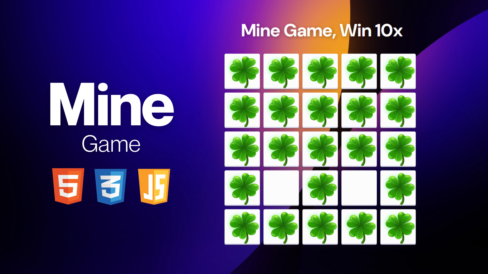

# Mine Game

## Description
The Mine Game is a simple browser-based game implemented using JavaScript. In this game, players click on buttons to reveal images. One of these buttons contains a bomb. The objective is to reveal all buttons except the one with the bomb to win the game.

## Features
- Random placement of the bomb within the buttons.
- Image revealed upon button click.
- Detection of winning conditions when all buttons except the one with the bomb are revealed.
- Video background for winning and losing scenarios.
- Restart button to reset the game after winning or losing.

## Support
For support or inquiries, please contact me via:
- Email: inquery.saurav@gmail.com
- LinkedIn: [Saurav Chaturvedi](https://www.linkedin.com/in/isaurav/)

## Preview

